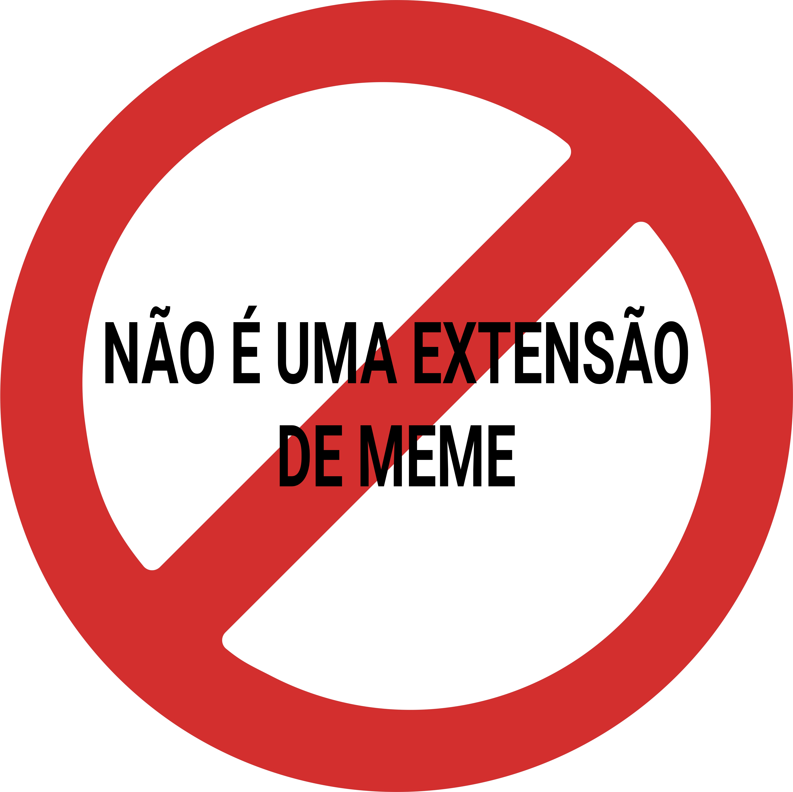

  

# Não é uma extensão de meme
Extensão feita para o auxílio de caloteiros do "Não é um grupo de meme".

## Propósito da extensão

Dado o problema da quantidade de comentários do grupo conhecido como "Não é um grupo de meme", essa extensão
visa curtir automaticamente todos os comentários do comentário principal do ponto `.` para que todos possam
voltar no post original mais tarde.
